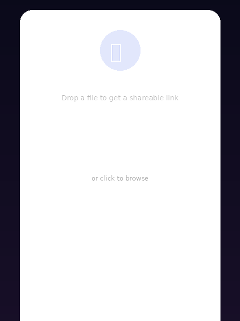
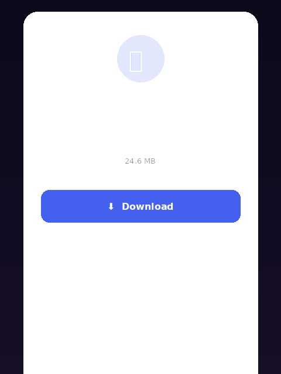

# sendit

**Simple file transfer, zero dependencies, works everywhere.**

Share files between devices instantly. The receiver only needs a browser — no app, no install, no account.

## Demo

| 🕸️ Send (drag & drop) | 📥 Receive (in browser) |
|:---:|:---:|
|  |  |

## Features

- 🕸️ **`sendit web`** — Drag & drop visual UI in your browser
- 📤 **`sendit send`** — Send files from command line
- 📱 **QR code** — Scan with your phone, no typing URLs
- 📊 **Progress bar** with speed & ETA (both terminal & browser)
- 🔒 **Random token** protects your file
- ⏱️ **Auto-shutdown** after transfer completes
- 💻 **Zero dependencies** — pure Python stdlib

## Installation

```bash
git clone https://github.com/stoktiks/sendit.git
cd sendit
pip install -e .
```

## Quick Start

### 🕸️ Visual sender (drag & drop)

```bash
sendit web
# → http://192.168.1.5:34137  — open in browser
```

Drag & drop any file → instantly get a shareable link + QR code. No terminal commands needed beyond starting it.

### 📤 CLI sender

```bash
sendit send ./bigfile.zip
# → 🔗 http://192.168.1.5:9876/a3b2c1
# → 📱 QR code in terminal
```

### 📥 Receiver (browser)

Scan the QR code or open the link. A clean download page appears with the file info and a real-time progress bar.

### 📥 Receiver (CLI)

```bash
sendit get http://192.168.1.5:9876/a3b2c1
```

Shows progress with speed & ETA:
```
  ██████████████░░░░░░░░  60%  117.3 MB/s  ETA 2s
  ████████████████████████  100%  127.0 MB/s  0.0s
✅ Saved to ./bigfile.zip
```

## Usage

```bash
# Sender: visual mode — drag & drop in browser
sendit web

# Sender: CLI mode
sendit send ./photo.jpg

# Sender: specific port
sendit send ./video.mp4 --port 8080

# Sender: longer timeout (default 5 min)
sendit send ./huge.zip --timeout 600

# Receiver: browser — just scan QR or open link

# Receiver: CLI download
sendit get http://192.168.1.5:9876/a3b2c1

# Receiver: custom filename
sendit get http://192.168.1.5:9876/a3b2c1 -o myfile.zip
```

## Why sendit?

| Tool | Install both sides? | Visual sender? | Progress bar? | QR code? |
|------|:---:|:---:|:---:|:---:|
| **sendit** | ❌ (browser works!) | ✅ (drag & drop) | ✅ | ✅ |
| scp/rsync | ✅ | ❌ | ❌ | ❌ |
| magic-wormhole | ✅ | ❌ | ✅ | ❌ |
| nc (netcat) | ✅ | ❌ | ❌ | ❌ |

## How It Works

1. **Sender** starts a tiny HTTP server
2. **CLI mode**: QR code + URL appear in the terminal
3. **Web mode**: a beautiful drag & drop page opens in the browser
4. **Receiver** scans QR or opens the link — no app needed
5. **Progress bar** shows real-time speed & ETA
6. Server **auto-shuts down** after transfer

## License

MIT
